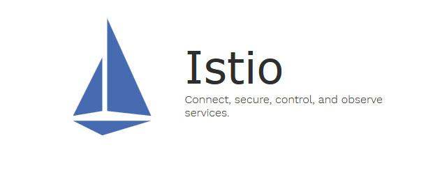
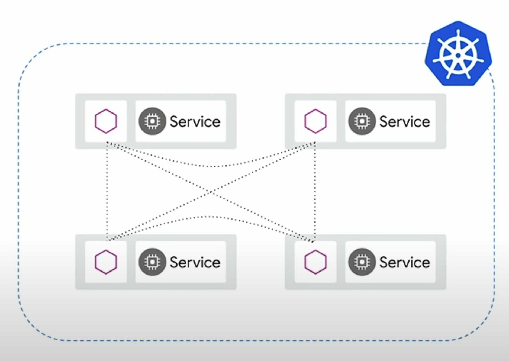
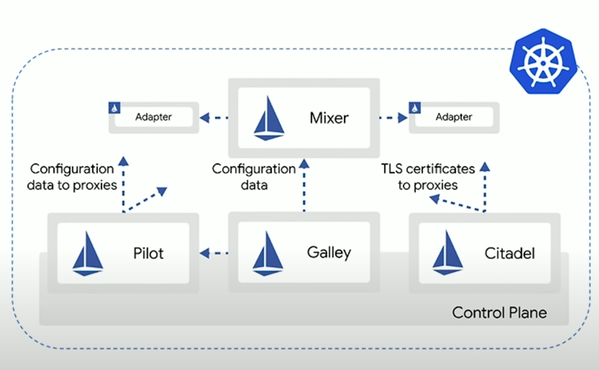
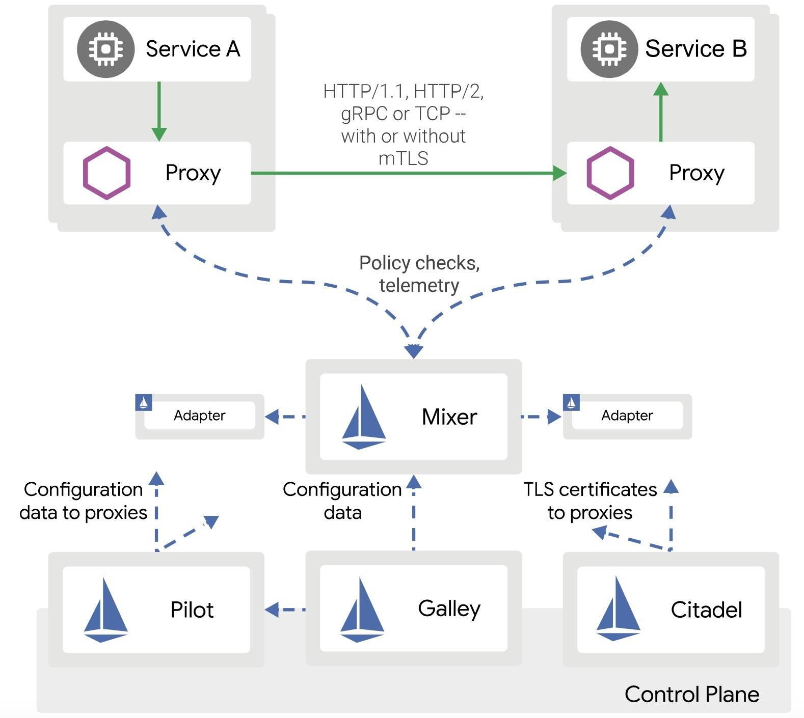
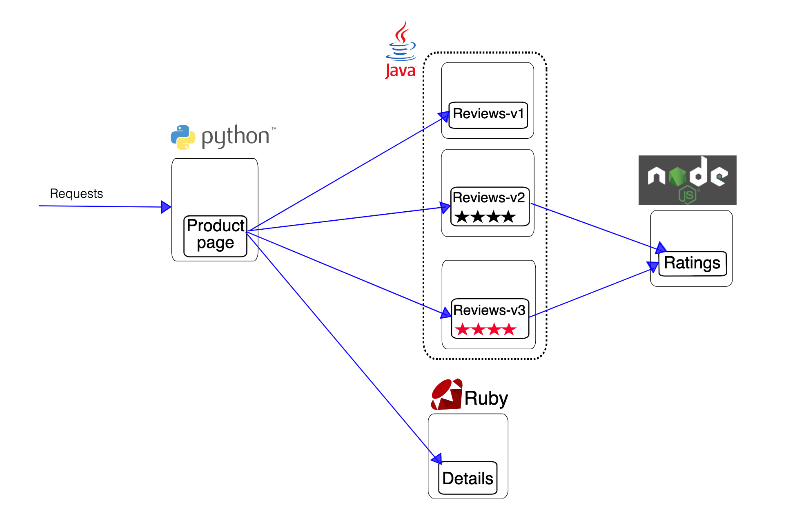

# Microservices architecture

**Microservices (microservice architecture)** - a style that structures an application as a collection of services that are:

- Highly maintainable and testable
- Loosely coupled
- Independently deployable
- Organized around business capabilities
- Owned by a small team

## Monolithic architecture (old school)

**Monolith means composed all in one piece.** The Monolithic application describes a single-tiered software application in which different components combined into a single program from a single platform.

## Video references

  - Microservices vs Monolithic - [What are Microservices?](https://www.youtube.com/watch?v=CdBtNQZH8a4) (7 min)

gatsby-slide

# Service mesh

**Service mesh** - an infrastructure layer for facilitating service-to-service communications between microservices, often using a **sidecar proxy**.

Provides **transparent and language-independent** way to flexible and easily automate application network functions:

  - Connection
  - Control
  - Observability
  - Secure

## Platforms implementing a service mesh:

  - **Istio**
  - Consul
  - Linkerd

## Video references

  - [What is a service mesh](https://www.youtube.com/watch?v=vh1YtWjfcyk&t=38s) (10 min)
  - [Demystifying Service Mesh](https://www.youtube.com/watch?v=bEFILWrRJJ4) (36 min) - an excellent presentation

gatsby-slide

# Istio

**Istio** - a platform that implements a service mesh.

**Benefits**

- Understand **network interaction** between services
- Traffic **inspection** between services
- Granular policies (specific users, specific groups, or all users) - **percentage-based** routing
- **Automate** policies across thousands of services
- **Decouple** the network from your application code

**You can easily do with Istio:**

  - canary rollout - ** we will do today**
  - A/B testing
  - rate limiting
  - access control
  - end-to-end authentication

## Video references

  - [What is Istio?](https://www.youtube.com/watch?v=1iyFq2VaL5Y) (4 min)
  - [Istio Service Mesh Explained](https://www.youtube.com/watch?v=6zDrLvpfCK4) (5 min)
  - [Kubernetes drone demo: Using Istio to manage app traffic](https://www.youtube.com/watch?v=QTD-gqS2E7w) (2 min) - representing a canary rollout
  - [Istio in Production: Day 2 Traffic Routing (Cloud Next '19)
](https://www.youtube.com/watch?v=7cINRP0BFY8) (42 min)

## Links

  - [Official website](https://istio.io/)
  - [What is Istio?](https://istio.io/docs/concepts/what-is-istio/)

gatsby-slide

# How Istio works

## Sidecar proxy

- **Sidecar proxies** ([Envoy](https://www.envoyproxy.io/)) sit next to workloads (in Kubernetes pods)
- Proxies **mediate** all inbound/outbound traffic

gatsby-slide

# How Istio works

## Control Plane

- **Control Plane** deployed to Kubernetes
- **Isito API** installed as Kubernetes CRDs (Custom Resource Definitions)

gatsby-slide

# How Istio works

gatsby-slide

# Our work objectives

1. Quick start with Istio (using Bookinfo example application)
2. Traffic management: Request routing
3. Traffic Management: Traffic shifting (canary rollout)

Bookinfo example application:

gatsby-slide

# 1. Quick start with Istio

## Instructions

1. [Install Minikube and start a Kubernetes cluster](https://istio.io/docs/setup/platform-setup/minikube/)

After Minikube installation run:

  - `minikube config set vm-driver virtualbox` (or `vmware`, or `kvm2`)
  - `minikube start --memory=16384 --cpus=4 --kubernetes-version=v1.18.0`

2. [Install Istio](https://istio.io/docs/setup/getting-started/)

Do everything up to the [Next steps](https://istio.io/docs/setup/getting-started/#next-steps) section.

## Results

  - running [Bookinfo example application](https://istio.io/docs/examples/bookinfo/) and available at `http://$GATEWAY_URL/productpage` (where $GATEWAY_URL - is specific IP and PORT for every deployment)
  - running [Kiali dashboard](https://kiali.io/) with an overview of your mesh with the relationships between the services, like on [this image](https://istio.io/docs/setup/getting-started/kiali-example2.png).

  

gatsby-slide

# 2. Request routing

This task shows you how to route requests dynamically to multiple versions of a microservice.

### Instructions

- [Request routing](https://istio.io/docs/tasks/traffic-management/request-routing/)

### Results

  - sending 100% of the traffic to the `v1` version of each of the Bookinfo services
  - setting a rule to selectively send traffic to version `v2` of the reviews service based on a custom `end-user` header

gatsby-slide

# 3. Traffic Shifting (canary rollout)

This task shows you how to gradually migrate traffic from an older version to a new version.

### Instructions

- [Traffic shifting](https://istio.io/docs/tasks/traffic-management/traffic-shifting/)

### Results

  - migrating traffic from an old to new version of the `reviews` service using Istio’s weighted routing feature

gatsby-slide
